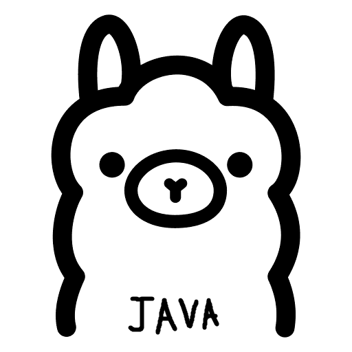

<p align="center">
  <a href="https://ollama.com">
    
  </a>
</p>

<p align="center">
  
  
  
  
</p>

> Run Ollama where Docker cannot.

---

## Overview

A lightweight Java wrapper that bundles the [Ollama](https://github.com/ollama/ollama) runtime directly inside a `.jar` file. On startup it extracts the bundled binary and libraries, then exposes a reverse proxy with a small admin API for runtime configuration — no Docker, no root, no package manager required.

## How It Works

The proxy sits between the client and the Ollama process:

```
Client → Proxy (server-port) → Ollama (server-port + 1)
```

All standard Ollama API requests are forwarded transparently via streaming. The two `/admin/*` endpoints allow changing environment variables and restarting the Ollama process without restarting the JVM.

## Dependencies

| Library | Version | Bundled |
|---|---|---|
| [Ollama](https://github.com/ollama/ollama) | v0.16.3 | yes (tar inside jar) |
| [Gson](https://github.com/google/gson) | 2.13.1 | yes (jar inside jar) |

No other external libraries. Uses only Java standard library (`com.sun.net.httpserver`).

## Resource Structure

```
src/main/resources/
  ollama-linux-amd64.tar    # ollama binary + cpu libs, gpu libs removed
  gson-2.13.1.jar
```
## Quick Start
```bash
java -jar server.jar
```
## Configuration

`server.properties` next to the jar:

```properties
server-port=11434
```

Ollama will run internally on `server-port + 1`. The proxy listens on `server-port`.

## API

### Proxy

All standard Ollama endpoints are available at the proxy port.

```bash
# List models
curl http://host:11434/api/tags

# Generate
curl http://host:11434/api/generate \
  -d '{"model":"llama3","prompt":"hello"}'

# Chat
curl http://host:11434/api/chat \
  -d '{"model":"llama3","messages":[{"role":"user","content":"hello"}]}'
```

### Admin

**PATCH /admin/settings** — update Ollama environment variables. Takes effect after restart.

```bash
curl -X PATCH http://host:11434/admin/settings \
  -H "Content-Type: application/json" \
  -d '{
    "OLLAMA_NUM_PARALLEL": "4",
    "OLLAMA_CONTEXT_LENGTH": "8192",
    "OLLAMA_KEEP_ALIVE": "10m",
    "OLLAMA_MAX_LOADED_MODELS": "2"
  }'
```

Response:
```json
{
  "applied": {
    "OLLAMA_NUM_PARALLEL": "4",
    "OLLAMA_CONTEXT_LENGTH": "8192"
  },
  "rejected": {}
}
```

**POST /admin/restart** — restart the Ollama process with current settings.

```bash
curl -X POST http://host:11434/admin/restart
```

Response:
```json
{ "status": "restarting" }
```

### Supported Environment Variables

```
OLLAMA_HOST             OLLAMA_ORIGINS          OLLAMA_REMOTES
OLLAMA_NO_CLOUD         OLLAMA_CONTEXT_LENGTH   OLLAMA_NUM_PARALLEL
OLLAMA_NUM_THREADS      OLLAMA_MAX_QUEUE        OLLAMA_MAX_LOADED_MODELS
OLLAMA_SCHED_SPREAD     OLLAMA_MODELS           OLLAMA_MULTIUSER_CACHE
OLLAMA_NOPRUNE          OLLAMA_NOHISTORY        OLLAMA_LOAD_TIMEOUT
OLLAMA_KEEP_ALIVE       OLLAMA_NEW_ENGINE       OLLAMA_LLM_LIBRARY
OLLAMA_FLASH_ATTENTION  OLLAMA_KV_CACHE_TYPE    OLLAMA_VULKAN
OLLAMA_GPU_OVERHEAD     CUDA_VISIBLE_DEVICES    GPU_DEVICE_ORDINAL
HIP_VISIBLE_DEVICES     HSA_OVERRIDE_GFX_VERSION ROCR_VISIBLE_DEVICES
GGML_VK_VISIBLE_DEVICES HTTPS_PROXY             HTTP_PROXY
NO_PROXY                LD_LIBRARY_PATH         HOME
PATH
```

`OLLAMA_NUM_THREADS` defaults to the number of CPU threads available on the host.
## Fun Fact
This project uses `server.properties` for configuration:

— the same filename Minecraft servers use. That is not a coincidence. Most Minecraft game hosting panels (Pterodactyl, Pelican, etc.) are designed around Java `.jar` files and expose a `server-port` variable through `server.properties` out of the box. This means you can deploy Ollama on virtually any Minecraft-compatible hosting plan without touching the panel configuration 

— just upload the jar and start it.
## Credits
|  | [ollama/ollama](https://github.com/ollama/ollama) |
|----------------------------------------|---------------------------------------------------|